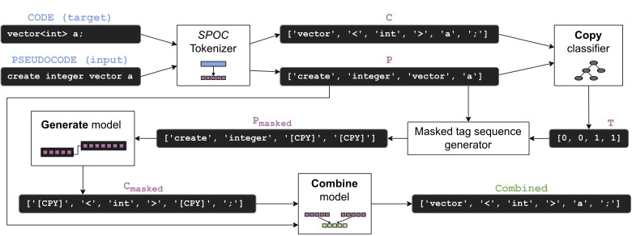

# C3PO: A Lightweight Copying Mechanism for Translating Pseudocode to Code

Source Code for the C3PO paper published at AACL-IJCNLP 2022 (Student Research Workshop)
[[Paper]](https://aclanthology.org/2022.aacl-srw.7.pdf)



# Stages of the Pipline 
1. Copy Phase 
2. Generate Phase 
3. Combine Phase 

# Getting Started 
1. Install conda or miniconda
2. Create a conda environment 
```sh 
conda create -f c3po.yml 
conda activate c3po
``` 
3. Download the [SPOC dataset](https://sumith1896.github.io/spoc/) as a zip and unzip into into the `data/` folder

# Data Preprocessing 
Data preprocessing of the [SPOC dataset](https://sumith1896.github.io/spoc/) to mask `[CPY]` tags using a decision tree is included under `cpy_preprocess/`.            
The preprocessed datasets are released in the `data/` folder.       
There are 2 versions of both the `train` and `eval` datasets. 
1. Normally masking tokens with `[CPY]` tokens. In `data/CPY_dataset.pkl` (for train set) and `data/CPY_dataset_eval.pkl` (for eval set)
2. Numbering the `[CPY]` tokens as `[CPY_1]` ... `[CPY_n]`. In `data/CPY_dataset_numbered.pkl` (for train set) and `data/CPY_dataset_numbered_eval.pkl` (for eval set)

# Models
Experiments were carried out with the 2 following architectures, which is included in the `models/` folder. 
1. Vanilla Seq2Seq (`models/vanilla_seq2seq.py`)
2. Attention Seq2Seq (`models/attention_seq2seq.py`)

# Training Seq2Seq models 
Scripts in `train_scripts/seq2seq_training.py`. 
Can train both
Usage:
```sh
python seq2seq_training.py
--attention # Boolean flag if attention seq2seq model to be trained (Default Vanilla Seq2Seq)
--non-copy # Boolean flag if non-copy version to be trained (no masking of tokens) (Default copy version)
```
The hyperparameters used have been set by default for each model

# Inference and Results 
Inference scripts are included in `inference/scripts/`. The predictions are released as `.pkl` files under `inference/predictions/` for the following versions
1. Attention Seq2Seq with C3PO (CPY masking)
2. Attention Seq2Seq w/o C3PO (No CPY masking)
3. Vanilla Seq2Seq with C3PO (CPY masking)
4. Vanilla Seq2Seq w/o C3PO (No CPY masking)

The results (BLEU scores) are computed using these prediction files in `inference/results.ipynb`

# Citation 
If you used this work in your research, please cite:
```
@inproceedings{veerendranath2022c3po,
    title={C3PO: A Lightweight Copying Mechanism for Translating Pseudocode to Code},
    author={Veerendranath, Vishruth and Masti, Vibha and Anagani, Prajwal and Hr, Mamatha},
    booktitle={Proceedings of the 2nd Conference of the Asia-Pacific Chapter of the Association for Computational Linguistics and the 12th International Joint Conference on Natural Language Processing: Student Research Workshop},
    pages={47--53},
    year={2022}
}
```